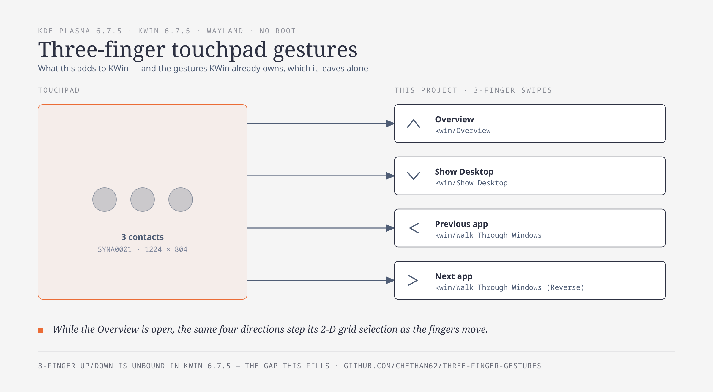

# three-finger-gestures — Windows-11-style touchpad gestures on KDE Plasma 6

Plasma 6 has **no gesture configuration UI**, and KWin's own touchpad gestures are
hardcoded in C++ (configurable gestures are a Plasma 6.8 goal). This adds the gestures
KWin leaves unbound by reading the touchpad directly and driving KWin — **no root**, no
libinput CLI, and no third-party daemon beyond `ydotool` for the one case KWin exposes
no action for.



Three fingers, and the Overview selection moves *with* your fingers.

## What it adds, and what KWin already owns

Read from KWin's source, not folklore:

| Gesture | Action | Owner |
| --- | --- | --- |
| 4-finger up | Overview | **KWin** — `src/plugins/overview/overvieweffect.cpp` |
| 4-finger down | Desktop Grid | **KWin** — same |
| 3- and 4-finger left/right | switch virtual desktop | **KWin** — `src/virtualdesktops.cpp` |
| 3-finger up | Overview (Task View) | this project |
| 3-finger down | Show Desktop | this project |
| 3-finger left / right | previous / next app | this project |
| 3-finger left / right **while the Overview is open** | move the grid selection | this project |

Mapping a direction KWin already owns means both actors fire on one swipe and the result
is a stutter (an open/close flicker). That is why the table is split this way.

## What it looks like


The blue outline is the Overview's selection — the thing the three-finger swipes move. The
windows are placeholders on purpose: the Overview renders live thumbnails of every open
window, so a capture of a real desktop would publish whatever happened to be on it. The
stepping is driven through the same key injection the daemon uses for the Overview; the
swipe itself needs a physical touchpad.

## Measured on

- CachyOS, Plasma **6.7.5**, KWin **6.7.5**, Wayland session
- Synaptics `SYNA0001:00 06CB:7F28` touchpad, ABS span **1224 × 804**
- `ydotool` 1.0.4, python 3.14

## Verified, and not

**Verified**

- detection against real swipes from the physical pad — the `--debug` capture logged
  `up dx=49 dy=-380`, `down dx=11 dy=484`, `right dx=238 dy=43`;
- the Overview selection path end-to-end through the daemon's own `fire()`: the
  accent-highlight split moved `1931/1914 → 1930/10738`, and `RIGHT,RIGHT,LEFT` returned
  to exactly the RIGHT-only state;
- thresholds, parser, guards and routing, by `test-three-finger-gestures.py`, which
  `install.sh` runs as a gate before it will report success.

**Not verified**

- **No CI.** The self-check's final assertions read a *live touchpad*, so it cannot run on
  a headless runner; everything else about this project can only be asserted on real
  hardware. A workflow here would be theatre, so there isn't one.
- **Feel.** `SWIPE_FRACTION` and `STEP_FRACTION` are calibrated from the pad's geometry,
  not from a comfort study. They are the first thing to change.

## Requirements

- Linux + KDE Plasma 6 on Wayland, with KWin 6
- `python3`, `qdbus6` (qt6-tools)
- `ydotool` **and** its `ydotoold` service (the installer enables it)
- your user in the **`input`** group, for read access to `/dev/input/event*`

## Install

```bash
# from a clone, or from the installed source dir (~/.local/share/three-finger-gestures)
./install.sh              # install or reinstall, then verify
./install.sh --verify     # verify only, changes nothing
```

Idempotent. It writes the systemd **user** unit with `ExecStart` derived from its own
location — never a hardcoded path, so it cannot end up pointing at a stale copy — enables
`ydotoold`, then verifies: unit active, enabled at login, `ydotoold` running, the daemon
holding a `/dev/input/event*` fd, no unregistered action names, and the self-check passing.
Any failure is reported by name and the script exits non-zero.

## Uninstall

```bash
./install.sh --uninstall  # stop and remove the service, keep the sources
./install.sh --purge      # ...and delete the source directory
```

No root needed; both stop the service immediately rather than at next login. Note that
`--purge` deletes the directory the script is running from — which is the clone, if that is
where you ran it.

If the sources are already gone, remove the service by hand:

```bash
systemctl --user disable --now three-finger-gestures
rm -f ~/.config/systemd/user/three-finger-gestures.service
systemctl --user daemon-reload
```

`ydotoold` is deliberately left running either way, since other tools may use it.
`systemctl --user disable --now ydotool` removes that too.

## Gotchas

- **The Overview's arrow keys need `ydotoold`.** KWin exposes no action for moving the grid
  selection, so those four swipes inject `KEY_UP/DOWN/LEFT/RIGHT` through `ydotool`. If you
  would rather not run an input-injection daemon, `systemctl --user disable --now ydotool`
  and the Overview swipes simply do nothing — every other gesture keeps working.
- **`wtype` cannot do this job** — KWin reports *"Compositor does not support the virtual
  keyboard protocol"*. That is why the dependency is `ydotool`.
- **An upward swipe does not close the Overview** while the grid is open: it moves the
  selection up, because all four directions navigate a 2-dimensional grid. Close with
  KWin's own 4-finger up, Escape, or by clicking a window.
- KGlobalAccel **silently accepts unknown action names** — `invokeShortcut "No Such
  Action"` still exits 0. That is why the daemon verifies its action names at startup
  instead of trusting a return code.

## Tuning

`SWIPE_FRACTION` `0.15` is the swipe threshold, as a fraction of each axis' own span (pads
are not square). `STEP_FRACTION` `0.35` is how far the fingers travel per Overview step.
Both sit at the top of `three-finger-gestures.py`:

```bash
systemctl --user stop three-finger-gestures
python3 three-finger-gestures.py --debug     # swipe; watch what it reports
./install.sh                                 # reapplies + verifies
```

## Files

| file | what it does |
| --- | --- |
| `three-finger-gestures.py` | the daemon: reads the pad, parses MT protocol B, drives KWin |
| `test-three-finger-gestures.py` | the gate: thresholds, parser, guards, routing |
| `install.sh` | install / verify / uninstall the user unit |

## Licensing

MIT — see `LICENSE`.

Nothing third-party is vendored. The daemon drives KWin's own `KGlobalAccel` DBus
interface and invokes the system `ydotool`; both are installed and licensed separately,
and no code from KWin, libinput or ydotool is copied into this repository.
